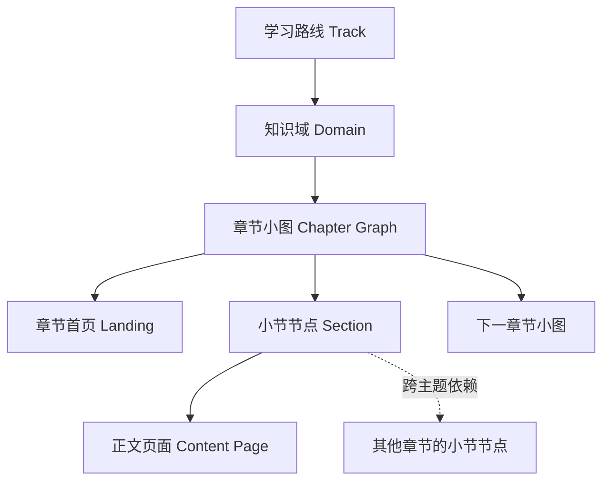

# 双轨层级知识星图结构参考

日期：2026-08-25

## 1. 设计结论

统一站点保留当前“知识星图”视觉语言，同时提供两条独立学习路线：

1. **精炼版**：当前 24 章 + 4 个 Lab，适合快速建立全局判断。
2. **进阶完整版**：高级手册的 31 个章节首页 + 约 220 个小节页，适合系统精读、工程实践和面试深挖。

两条路线使用同一套导航、搜索和阅读界面，但分别记录学习进度。

星图采用 **Graph of Graphs（图中有图）** 的层级结构：

- 每个小节是一个基础知识节点。
- 同一章的小节节点连接成一张章节小图。
- 章节小图之间通过学习顺序和知识依赖连接。
- 所有章节小图共同形成整本手册的全局大图。

## 2. 内容规模

### 精炼版

| 类型 | 数量 | 说明 |
| --- | ---: | --- |
| 正文章节 | 24 | 当前 `/ch1/` 至 `/ch24/` |
| 实战 Lab | 4 | 当前 `/lab1/` 至 `/lab4/` |
| Markdown 内容 | 约 0.77 MB | 当前项目 `content/` |
| 首页数据节点 | 28 | 24 章 + 4 Lab |

### 进阶完整版

来源：`AI-Agent-学习实践面试宝典-完整内容.zip`

| 类型 | 数量 | 说明 |
| --- | ---: | --- |
| 章节首页 | 31 | 系统教材、进阶专题、面试冲刺 |
| 独立小节 | 约 220 | 每章通常 6–10 个小节 |
| 附录 | 4 | 资料、论文、术语、30 天计划 |
| 站点 Markdown | 256 | 约 4.24 MB |
| 分类面试题 | 140 | 第 31 章，九大类别 |
| 示例工程 | 1 套完整工程 | 上下文工程 Agent，含测试和样例数据 |

### 高级手册独有价值

- 深入 Function Calling 生命周期、并行调用、流式解析和错误恢复。
- 独立的反思与自我改进章节。
- 独立的 LangGraph 与框架对照章节。
- 生产级多智能体客服系统完整案例。
- RAG、上下文工程和 Agent 评估进阶专题。
- 140 道分类面试题。
- 经典论文导读、术语表和完整学习资料索引。

### 当前精炼版独有价值

- 模型后训练：SFT、RLHF、DPO、GRPO。
- Coding Agent 架构。
- Agent 评估基准全景。
- 语音与实时交互 Agent。
- 云原生部署与数据飞轮。
- 四个短小、可快速上手的 Lab。

两套内容互补，不采用“高级手册完全覆盖精炼版”的处理方式。

## 3. 统一界面结构

```text
统一站点
├── 顶部导航
│   ├── 全局星图
│   ├── 章节库
│   ├── 全文搜索
│   └── 我的进度
├── 路线切换
│   ├── 精炼版
│   └── 进阶完整版
├── 全局知识图
│   ├── 章节小图 × N
│   ├── 主学习路径
│   └── 跨主题依赖
├── 章节聚焦面板
│   ├── 章节标题与知识域
│   ├── 章节小图放大视图
│   ├── 小节列表
│   └── 进入章节
└── 路线独立进度
```

### 路线切换

首页顶部使用双段切换控件：

```text
[ 精炼版 · 28 星 ] [ 进阶完整版 · 251 页 ]
```

切换路线时：

- 保持相同的页面布局和操作方式。
- 替换星图数据、图例、右侧章节面板和进度。
- 不合并两条路线的完成状态。
- 记住用户上次选择的路线。

## 4. 图中有图的数据层级



### 4.1 小节节点

小节是最小知识单位，例如：

```text
第 27 章 · 上下文工程
├── 上下文问题
├── 上下文预算与动态组装
├── Claude Code 的上下文管理
├── 长上下文退化
├── 压缩、摘要与编辑
├── 子智能体与上下文隔离
├── 外部记忆
├── Prompt Caching
├── 长任务编程 Agent
└── 生产踩坑与思考回答
```

小节节点状态：

| 状态 | 图形 |
| --- | --- |
| 未阅读 | 空心节点 |
| 正在阅读 | 金色双环节点 |
| 已完成 | 对应知识域颜色的实心节点 |

### 4.2 章节小图

每一章拥有独立小图：

- 中心节点代表章节首页。
- 周围节点代表独立小节。
- 实线表示建议阅读顺序。
- 可选支线表示补充阅读。
- 章节小图本身是全局图中的一个章节簇。

点击全局图中的章节簇时：

1. 其他章节簇降低透明度。
2. 右侧面板放大显示该章小图。
3. 展示小节标题与完成状态。
4. 用户可进入章节首页或直接打开某个小节。

### 4.3 全局大图

全局大图由全部章节小图组成。

连线分为三类：

| 连线 | 样式 | 含义 |
| --- | --- | --- |
| 章内顺序 | 细实线 | 同一章的小节阅读顺序 |
| 主学习路径 | 粗实线 | 推荐章节顺序 |
| 跨主题依赖 | 虚线 | 前置知识、延伸阅读或相互印证 |

跨主题连接示例：

```text
推理与规划 → 上下文工程
记忆系统 → 上下文工程
Agent 评估 → 评估进阶
安全护栏 → 成本与性能工程
多智能体协作 → 生产级客服系统
多模态 Agent → 场景实战题
RAG 深入 → 项目阶梯
```

## 5. 知识域划分

### 精炼版

沿用当前六个知识域：

1. 原理篇
2. 技术篇
3. 实践篇
4. 面试篇
5. 进阶篇
6. 实战工坊

### 进阶完整版

进阶完整版划分为八个知识域：

| 知识域 | 章节 |
| --- | --- |
| 认识 Agent | 1–3 |
| 核心能力原语 | 4–7 |
| 协议与编排 | 8–11 |
| 框架与实践 | 12–15 |
| 工程化与生产 | 16–18 |
| 实战项目 | 19–20 |
| 进阶专题 | 26–30 |
| 面试冲刺 | 21–25、31 |

附录不进入主学习路径，在全局图边缘作为资源节点展示。

## 6. 页面与路由

### 精炼版路由

保留现有稳定路径：

```text
/ch1/ ... /ch24/
/lab1/ ... /lab4/
/guide/
/quiz/
/insights/
/resources/
```

### 进阶完整版路由

使用独立命名空间：

```text
/advanced/
/advanced/chapter-01/
/advanced/chapter-27/
/advanced/chapter-27/context-budget/
/advanced/chapter-31/
/advanced/appendix-b/
```

路由原则：

- 章节首页和小节页都是可直接访问的静态页面。
- 页面刷新不会返回 404。
- 搜索结果明确标记“精炼版”或“进阶完整版”。
- 两条路线之间的相关内容使用“对应阅读”链接连接。
- 旧精炼版 URL 不重定向、不改名。

## 7. 阅读界面

进阶章节采用三栏阅读结构：

```text
左侧：全书目录与章节小节
中间：当前小节正文
右侧：本页标题目录、阅读进度、相关精炼章节
```

章节首页包含：

- 本章目标。
- 小节知识图。
- 小节列表。
- 所属知识域。
- 前置章节和延伸章节。
- 本章整体完成度。

小节页包含：

- 面包屑导航。
- 小节标题与描述。
- 正文、代码、表格和引用。
- 上一节 / 下一节。
- 标记完成。
- 返回章节小图。

## 8. 移动端

移动端不缩放整张全局大图。

### 全局视图

- 按知识域显示可展开列表。
- 每个章节条目展示一个缩略小图。
- 当前知识域默认展开。
- 路线切换固定在顶部。

### 章节视图

- 小节图改为横向可滚动的节点轨道。
- 正文保持单列。
- 全书目录和本页目录使用互斥抽屉。
- 触控目标不小于 44px。
- 不产生页面级横向溢出。

## 9. 学习进度

两条路线分别记录：

```text
精炼版：
  ah-read-chapters
  ah-last-chapter

进阶完整版：
  ah-advanced-learning-state
  ah-advanced-last-page
```

进阶完整版状态至少包含：

```json
{
  "completedSections": [],
  "completedChapters": [],
  "recent": [],
  "lastPage": "",
  "updatedAt": 0
}
```

规则：

- 完成小节只影响进阶版进度。
- 一个章节的全部小节完成后，章节节点点亮。
- 精炼版完成状态不会自动完成进阶小节。
- 两条路线可显示“对应内容已读”提示，但不互相增加完成度。
- 存储不可用时页面仍可阅读，只隐藏个性化进度。

## 10. 搜索

统一搜索同时索引两条路线。

搜索结果展示：

```text
[精炼版] 上下文工程
[进阶版] 上下文预算与动态组装
[进阶版] Prompt Caching 与成本
```

筛选条件：

- 全部
- 精炼版
- 进阶完整版
- 代码示例
- 面试题

搜索结果链接直接进入对应静态路由。

## 11. 高级内容导入边界

高级 ZIP 不能原样复制到项目中。

### 保留

- 31 个章节首页。
- 约 220 个正文小节。
- 4 个附录。
- 代码块、表格和公开引用。
- 上下文工程示例项目。
- 140 道分类面试题。

### 不导入

- Astro 站点源码。
- 已生成 HTML。
- Pagefind 构建产物。
- 临时 brainstorm 文件。
- 构建日志、PID、缓存和 Python egg-info。

### 必须清洗

| 问题 | 规模 | 处理 |
| --- | ---: | --- |
| `[$TRAE_REF](url)` | 1257 处 | 转换为普通 Markdown 引用链接 |
| “图片生成描述” | 251 处 | 移至作者备注或从学习正文隐藏 |
| Astro frontmatter | 256 文件 | 转换为当前统一内容元数据 |
| 绝对 `/chapters/...` 链接 | 大量 | 转换为 `/advanced/...` 路由 |
| 重复进度代码 | 一套 | 不导入，使用统一站点状态模块 |
| 框架与版本描述 | 易变化 | 保留检索日期和来源边界 |

## 12. 内容对应关系

两条路线不共享进度，但建立内容映射：

| 精炼版 | 进阶完整版 |
| --- | --- |
| 什么是 Agent | 第 1–3 章 |
| 核心组件 | 第 2 章 |
| 六大设计模式 | 第 4、7、10、11 章 |
| 上下文工程 | 第 27 章 |
| 记忆系统 | 第 5 章 |
| MCP | 第 9 章 |
| 框架全景 | 第 12、15 章 |
| smolagents | 第 13 章 |
| PydanticAI | 第 14 章 |
| Agentic RAG | 第 19、26 章 |
| 评估与可观测性 | 第 16、17、28 章 |
| 生产部署与避坑 | 第 18、20 章 |
| 面试题库 | 第 21–25、31 章 |
| 多模态 | 第 29 章 |
| 成本与安全 | 第 18、30 章 |
| 高级推理 | 第 4 章 |

精炼版中没有直接对应的主题继续保留：

- 后训练。
- Coding Agent。
- 评估基准。
- 语音 Agent。
- 云原生部署。

## 13. 推荐数据结构

```json
{
  "tracks": [
    {
      "id": "concise",
      "title": "精炼版",
      "domains": []
    },
    {
      "id": "advanced",
      "title": "进阶完整版",
      "domains": []
    }
  ],
  "domains": [
    {
      "id": "advanced-context",
      "track": "advanced",
      "title": "进阶专题",
      "chapters": ["advanced-ch27"]
    }
  ],
  "chapters": [
    {
      "id": "advanced-ch27",
      "track": "advanced",
      "route": "advanced/chapter-27",
      "title": "上下文工程",
      "sections": ["advanced-ch27-s01", "advanced-ch27-s02"]
    }
  ],
  "sections": [
    {
      "id": "advanced-ch27-s01",
      "chapter": "advanced-ch27",
      "route": "advanced/chapter-27/context-problem",
      "title": "上下文工程解决什么问题"
    }
  ],
  "relations": [
    {
      "from": "advanced-ch05",
      "to": "advanced-ch27",
      "type": "prerequisite"
    }
  ]
}
```

关系类型固定为：

```text
sequence       章内或主路径顺序
prerequisite   前置知识
deep-dive      精炼版到进阶版对应关系
related        横向相关主题
practice       理论到项目或 Lab
interview      知识到面试题
```

## 14. 构建边界

保留当前技术栈：

- Python 读取内容清单并生成静态页面。
- 原生 HTML/CSS/JavaScript。
- GitHub Pages 发布。
- 当前单文件 HTML 与 PDF 继续生成。

不迁移到高级 ZIP 中的 Astro 工程，原因：

- 当前项目已有稳定构建、测试、PDF 与发布链路。
- 双框架并存会增加维护成本。
- 需要的是高级内容，不是第二套前端工程。

新增构建职责：

1. 导入并清洗高级 Markdown。
2. 生成高级内容清单。
3. 生成章节小图和全局图数据。
4. 生成 `/advanced/` 静态路由。
5. 建立统一搜索索引。
6. 校验所有跨页链接和关系边。

## 15. 错误处理

构建阶段遇到以下情况直接失败：

- 节点 ID 或路由重复。
- 章节声明的小节不存在。
- 关系边指向不存在节点。
- 小节没有章节归属。
- 内部链接目标不存在。
- 引用转换后仍残留 `TRAE_REF`。
- 学习正文仍包含可见的“图片生成描述”。
- 页面引用的本地资源不存在。

## 16. 验收标准

### 内容

- 精炼版仍保持 24 章和 4 个 Lab。
- 进阶完整版包含 31 个章节首页、约 220 个小节和 4 个附录。
- 高级内容中无可见 `TRAE_REF` 标记。
- 作者用图片描述不出现在读者正文。

### 星图

- 精炼版和进阶版可在同一位置切换。
- 进阶版全局图展示 31 个章节簇。
- 每个章节簇内部节点数与实际小节数一致。
- 所有章节簇通过主路径连接成一张完整大图。
- 至少提供前置、深挖、实践和面试四类跨图关系。

### 阅读

- 章节首页和小节页可直接访问。
- 上一节、下一节和返回章节图正常。
- 两条路线进度互不干扰。
- 搜索可同时覆盖两条路线并标记来源。

### 回归

- 当前精炼版 URL 不变。
- 当前完整 HTML 与 PDF 仍可生成。
- Python、Node、整站链接和浏览器测试全部通过。
- 首页不加载全部高级正文。

## 17. 分阶段实施建议

### 第一阶段：内容导入

- 解包到临时工作区。
- 只选取 Markdown、示例工程和必要元数据。
- 完成引用、作者备注和路由清洗。
- 生成高级内容清单。

### 第二阶段：高级静态页面

- 增加 `/advanced/` 路由。
- 生成章节首页和小节页。
- 增加高级目录、翻页和独立进度。

### 第三阶段：层级知识图

- 扩展星图数据模型。
- 实现章节小图。
- 连接章节小图形成大图。
- 增加路线切换和移动端降级。

### 第四阶段：统一搜索与关系

- 构建双轨搜索索引。
- 建立精炼—进阶对应关系。
- 增加前置、实践和面试关系。

### 第五阶段：全量回归与发布

- 内容完整性检查。
- 路由与资源检查。
- 桌面和移动浏览器验收。
- 完整 HTML 与 PDF 回归。
- GitHub Pages 部署验证。

## 18. 不在本次结构中的内容

- 两条路线自动共享完成进度。
- 用户登录与云端同步。
- 排行榜、积分或社交功能。
- 直接运行第二套 Astro 站点。
- 将 251 个页面正文一次性加载到首页。
